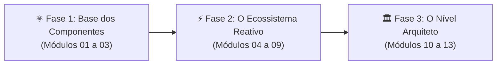

# ⚛️ Do Componente ao Arquiteto
### A Formação Definitiva em Engenharia Frontend com React 19

[](https://react.dev)
[](https://www.typescriptlang.org/)
[](https://vite.dev)
[](https://vitest.dev)
[](https://zustand-demo.pmnd.rs/)
[](#)

> **"Não seja apenas um colador de componentes. Torne-se um Engenheiro Frontend completo dominando da base dos componentes à arquitetura corporativa em React 19."**

Este projeto é uma **formação prática de ponta a ponta** estruturada para transformar desenvolvedores em engenheiros de software frontend de alto calibre no ecossistema React. Cobrindo desde a reconciliação e ciclo de vida de hooks até gerenciamento global atômico com Zustand, resiliência HTTP, Clean Architecture e o projeto integrador DevLearn Pro.

---

## 🧭 As Três Fases da Formação



1. **⚛️ Fase 1: A Base dos Componentes (O Framework Moderno)**  
   *Virtual DOM por baixo do capô, JSX desmistificado, Props, Imutabilidade, hooks de ciclo de vida (`useState`, `useEffect`, `useRef`), Compound Components e Custom Hooks reutilizáveis.*
2. **⚡ Fase 2: O Ecossistema Reativo (Arquitetura & Estado)**  
   *Context API sem prop drilling, HTTP resiliente com retry e fallback mock, formulários com arrays dinâmicos e validação cruzada, React Router com Guards, Programação Reativa com debounce e State Management com Zustand.*
3. **🏛️ Fase 3: O Nível Arquiteto (Engenharia, Produção & Escala)**  
   *Testes automatizados com Vitest e React Testing Library, profiling e otimização com `React.memo`, `useMemo`, `useCallback`, `Suspense`, princípios SOLID, Strategy Pattern e o Projeto Final Integrador (DevLearn Pro).*

---

## 📚 Grade Curricular dos 13 Módulos

| Módulo | Tema | Destaques Práticos Implementados |
| :--- | :--- | :--- |
| **01** | **Fundamentos do React 19** | Virtual DOM, árvore Fiber, JSX compilado e laboratório interativo de imutabilidade com histórico de referências. |
| **02** | **Hooks Essenciais & Lifecycle** | `useState`, `useEffect` com cleanup, `useRef` para valores mutáveis e acesso ao DOM, cronômetro de precisão e monitor de renders. |
| **03** | **Composição & Custom Hooks** | Padrão Compound Components (Accordion interativo), projeção via `children` e criação dos hooks `useToggle` e `useLocalStorage`. |
| **04** | **Context API & Injeção de Estado** | Injeção de dependência via Context Providers, controle de acesso baseado em papéis (RBAC) e isolamento de estado. |
| **05** | **HTTP, Data Fetching & Resiliência** | Operações CRUD completas, política de Retry com backoff, cancelamento com `AbortController` e fallback mock para modo offline. |
| **06** | **Formulários Reativos & Validação** | Cadastro completo com validação de formato de e-mail em tempo real, validação cruzada de senhas e array dinâmico de tags. |
| **07** | **Roteamento Avançado & Route Guards** | React Router, parâmetros de rota, query strings reativas e simulador interativo de Guards de proteção e redirecionamento. |
| **08** | **Programação Reativa & Streams** | Tratamento de fluxos assíncronos, debounce (400ms) de busca, redução de 90%+ de tráfego e timeline gráfica de eventos (Marble Stream). |
| **09** | **State Management com Zustand** | Store global de carrinho de compras atômica e previsível, cupons de desconto, seletores computados e visualizador em tempo real. |
| **10** | **Testes com Vitest & RTL** | Testes automatizados rápidos com Vitest e Testing Library, spies, asserções semânticas e test runner interativo no browser. |
| **11** | **Performance & Otimização** | `useMemo` para cálculos pesados (Fibonacci), `useCallback` para estabilidade referencial e Lazy loading com `Suspense`. |
| **12** | **Design Patterns & SOLID** | Padrão Strategy para gateways de pagamento (Cartão, Pix, Boleto), os 5 princípios SOLID detalhados e Clean Code. |
| **13** | **Projeto Integrador: DevLearn Pro** | Portal completo SPA em React 19 com catálogo de cursos, filtros por busca/categoria, matrículas, KPIs em tempo real, modais e toasts. |

---

## 🚀 Como Executar Localmente

### Pré-requisitos
- **Node.js** v18+ ou v20+
- **npm** v9+

### Passo a Passo

```bash
# 1. Acesse a pasta do projeto
cd react-curso-completo

# 2. Instale as dependências
npm install

# 3. Inicie o servidor de desenvolvimento
npm run dev
```

Acesse em seu navegador o endereço fornecido pelo Vite (ex: **`http://localhost:5173/`**).

---

## 🧪 Testes Automatizados

O projeto conta com suíte de testes unitários automatizada com **Vitest**:

```bash
# Executar todos os testes unitários (modo single-run)
npm test

# Executar testes em modo watch (desenvolvimento contínuo)
npm run test:watch
```

### Compilação de Produção
Para verificar a integridade de tipagem TypeScript estrita e bundle final:

```bash
npm run build
```

---

## 📁 Estrutura Arquitetural

```
src/
├── components/                 # Componentes compartilhados de layout
│   ├── Sidebar.tsx             # Menu lateral inteligente com busca e níveis
│   └── MobileHeader.tsx        # Barra de navegação superior responsiva
├── data/
│   └── modules.ts              # Metadados e catálogo dos 13 módulos
├── pages/
│   ├── Home/                   # Dashboard inicial da formação
│   ├── Modulo01Fundamentos/    # Virtual DOM e Imutabilidade
│   ├── Modulo02Hooks/          # Hooks, Lifecycle e Cleanup
│   ├── Modulo03Composicao/     # Compound Components e Custom Hooks
│   ├── Modulo04ContextApi/     # Context API e RBAC
│   ├── Modulo05Http/           # CRUD, Retry e Fallback Mock
│   ├── Modulo06Formularios/    # Formulários e Array Dinâmico
│   ├── Modulo07Routing/        # React Router e Route Guards
│   ├── Modulo08Streams/        # Streams, Debounce e Marble
│   ├── Modulo09Zustand/        # Store Global com Zustand
│   ├── Modulo10Testes/         # Vitest e Testing Library
│   ├── Modulo11Performance/    # useMemo, useCallback e Lazy
│   ├── Modulo12Patterns/       # Strategy Pattern e SOLID
│   └── Modulo13ProjetoFinal/   # DevLearn Pro SPA Completa
├── types/
│   └── course.ts               # Interfaces globais TypeScript
├── App.tsx                     # Roteador central e layout
├── index.css                   # Design System e Tokens CSS
└── main.tsx                    # Ponto de entrada com BrowserRouter
```
